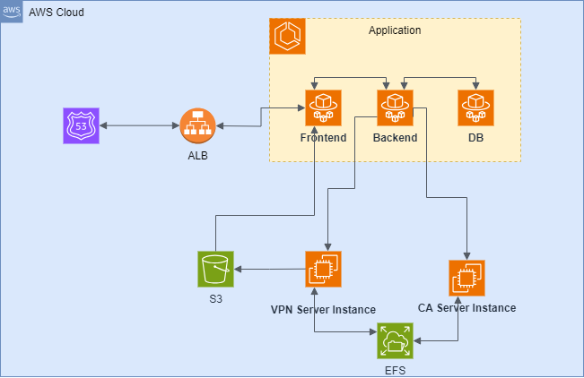

# VPNサーバーマネージャー

このプロジェクトは、OpenVPNサーバー管理ツールおよびクライアント構成ファイル生成ツールです。主に2つの部分からなるフルスタックアプリケーションです：バックエンドとフロントエンド。

## バックエンド

バックエンドは、[backend](backend/)ディレクトリにあるNode.jsアプリケーションです。サーバー管理にはExpress、API構造にはGraphQL、データベース操作にはPrismaを使用しています。また、認証にはJWT、クラウドサービスにはAWS SDKを使用しています。

## フロントエンド

フロントエンドは、[frontend](frontend/)ディレクトリにあるNuxt.jsアプリケーションです。ユーザーインターフェースにはVue.js、ルーティングにはVue Routerを使用しています。また、HTTPリクエストにはAxios、認証にはJSON Web Tokensを使用しています。

## 使用技術

- Node.js
- Express
- GraphQL
- Prisma
- JWT
- AWS SDK
- Nuxt.js
- Vue.js
- Vue Router
- Axios

## License

This project is licensed under the terms of the license found in the [LICENSE](LICENSE) file.
